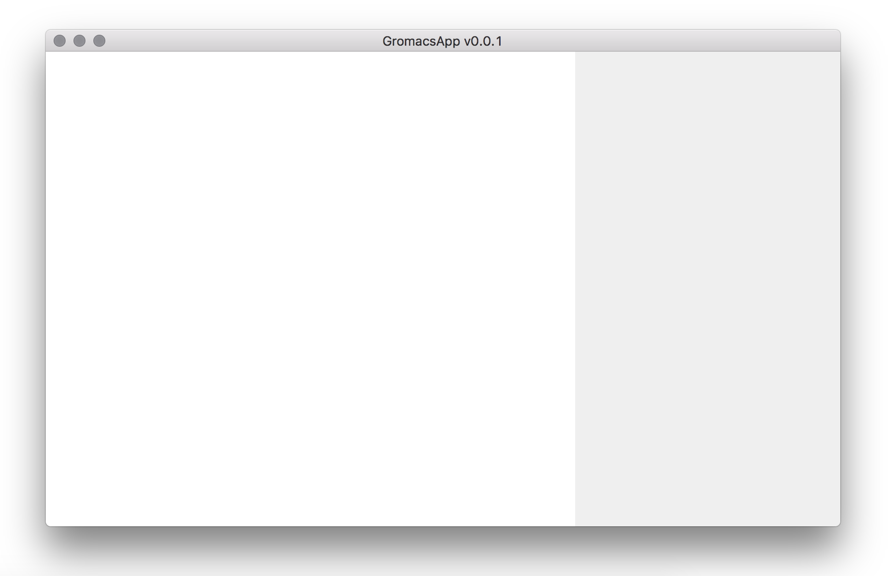
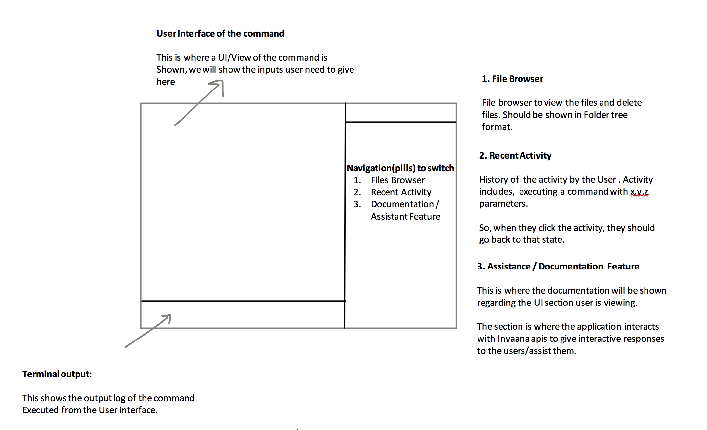

# GromacsApp

Native Desktop App of a scientific tool called Gromacs.

To build and run the app in development `ng build && electron`

To build a desktop app `electron-packager . GromacsApp --platform=darwin`

## The App Features

